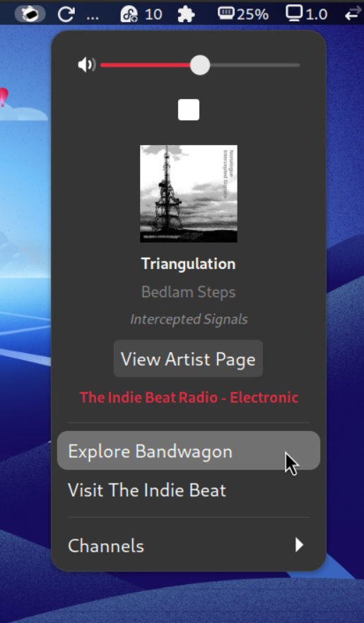

# The Indie Beat - GNOME Shell Extension

The Indie Beat is a GNOME Shell extension that allows you to stream independent music from artists in the Fediverse, thanks to [The Indie Beat Radio FM](https://theindiebeat.fm), [Bandwagon](https://bandwagon.fm), and the artists who share their music there.

## Features

- Stream music from [The Indie Beat](https://theindiebeat.fm/)
- Switch between different radio channels
- Control playback with play/pause buttons
- Adjust volume and mute audio
- View track metadata including title, artist, and album

  

## Requirements

- A recent version of GNOME Shell
- GStreamer and plugins

## Installation

### Install from GNOME Extensions website

(soon)

### Manual installation

1. Clone the repository:

    ```sh
    git clone https://github.com/andypiper/theindiebeat-gnome-ext.git
    ```

2. Navigate to the extension directory:

    ```sh
    cd theindiebeat-gnome-ext
    ```

3. Copy the extension to the GNOME Shell extensions directory:

    ```sh
    cp -r tibr-ext@andypiper.lol ~/.local/share/gnome-shell/extensions/
    ```

4. Restart GNOME Shell:
    - Press `Alt + F2`, type `r`, and press `Enter`.
    - (on Wayland, logout and log back in)

5. Enable the extension using the Extensions app.

## Usage

- Click on the catellite icon in the top panel to open the extension menu.
- Use the play/pause button to control playback.
- Adjust the volume using the slider.
- Switch between available channels from the Channels submenu.

## License

This project is licensed under the GPL v3 License. See `LICENSE` for details.

## Acknowledgements

- [Kirsten Lambertsen](https://mastodon.social/@mizkirsten) for being *awesome*.
- [The Indie Beat](https://theindiebeat.fm/) for providing the music streams (and the groovy catellite).
- [Bandwagon.fm](https://bandwagon.fm/) for being an excellent part of the Fediverse.
- [Neil Brown's blog post](https://neilzone.co.uk/2025/01/adding-the-indie-beat-radio-fm-to-lyrion-music-server-mpd-and-jellyfin/) on using The Indie Beat streams in Linux music players.
- originally inspired by [the SOMA FM extension](https://github.com/TheWeirdDev/somafm-radio-gnome-ext) for GNOME Shell (but shares no code, just the idea and a bit of the look).
